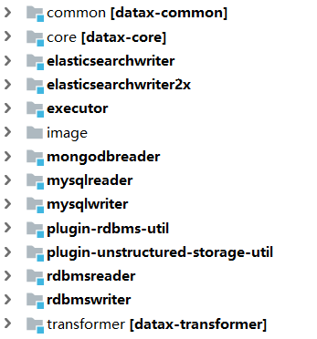
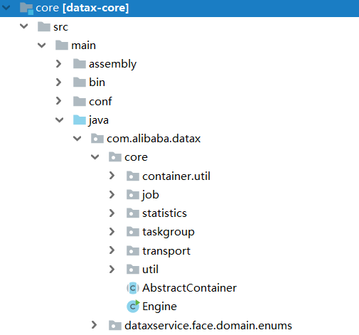

阿里巴巴Datax源码学习(1):源码学习
=
一:前言
==
1. Datax的简介
    >详细介绍请参考阿里巴巴Datax的github官网:https://github.com/alibaba/DataX
    简单介绍的话就是一个可以高效的同步迁移不同数据库之间数据的工具.
    如果有类似同步MongoDB的数据到Mysql之类的需求,用Datax是再好不过了.
    可能有些开发人员觉得开发一个数据同步的工具不难.但其实想写一个高效,准确且支持多种不同数据库的数据同步的工具还是很难的.
    Datax好就好在支持很多数据库,且同步数据非常高效,准确.

2. 学习Datax源码的好处
    >Datax有很多值得学习的地方,特别对于初中级Java开发人员来说可以学到包括但不限于以下几点.比起像Spring之类的大型框架,Datax相对而言更容易理解学习.
    >   1.  框架设计
    >   2.  多线程处理
    >   3.  异常处理
    >   4.  面向对象编程
    >   5.  数据库的灵活使用
    >   6.  使用JSON配置文件
    >   7.  类加载


3. 从哪些方面进行学习分享
    >不管任何框架工具的源码学习,我任务先了解其框架设计,运行原理,脑子里面先有一个印象,这样学习起来会比较轻松一些.所以Datax的源码学习将从它的框架分析开始,然后再开始学习分析其源码.
    
二:框架分析
==
1.  **模块结构**(不包含所有读写插件模块)

部分模块说明:
    *   跟框架相关模块
        *   common: 基础公共类的定义,包括元素,异常类,统计类,读写接口定义等
        *   core : 框架核心运行类,包括任务执行容器类等
        *   transformer: 传输相关类,用的不多
    *   读写插件模块
        *   关系型数据库读写公用抽象插件:plugin-rdbms-util,rdbmsreader,rdbmswriter
        *   plugin-unstructured-storage-util: 好像没怎么用到
        *   mongoreader等具体读写插件
2.  **框架设计**

    *注:引用官方图片
3.  **运行流程**

    **文字描述**:
        1.  同步作业Job根据配置切分数据同步任务为几个小的task任务
        2.  将多个小任务task组合成若干组taskgroup执行
        3.  每个小任务都有私有的reader,writer,channel以保证线程安全
        4.  channel负责数据传输,一个任务只有一个channel,reader读数据到channel,writer从   channel取数据
    **框架作业执行流程**:


三:框架核心模块源码分析
==

1.目录说明
===

*   assembly:maven打包相关
*   bin: python执行脚本
*   conf:相关配置文件

2.源码分析
===

>Datax工具的核心类图和流程参考下图(引用来源:https://www.jianshu.com/p/e63c40434fc1)
我觉得画的不错,就不重复造轮子了.源码的分析路径就按照此图来展开了.


1.  **datax.py**
>python不是很熟悉,然后datax.py主要是读取命令行参数,包括任务配置文件名等,以及获取操作系统环境所需参数.因为不是很熟悉就不展开说了.
2.  **Engine**
>框架的任务执行入口类,主要作用是解析命令行参数,并初始化任务执行容器JobContainer(分布式的时候可能是初始化TaskGroupContainer,可惜DataX并没有公开分布式相关的代码)
```java
//入口方法
public static void entry(final String[] args) throws Throwable {

    //解析命令行参数
    Options options = new Options();
    options.addOption("job", true, "Job config.");
    options.addOption("jobid", true, "Job unique id.");
    options.addOption("mode", true, "Job runtime mode.");

    BasicParser parser = new BasicParser();
    CommandLine cl = parser.parse(options, args);

    String jobPath = cl.getOptionValue("job");

    // 如果用户没有明确指定jobid, 则 datax.py 会指定 jobid 默认值为-1
    String jobIdString = cl.getOptionValue("jobid");
    RUNTIME_MODE = cl.getOptionValue("mode");

    // 读取任务json配置文件,并封装程自定义的Configuration类
    Configuration configuration = ConfigParser.parse(jobPath);

    
    long jobId;

    //判断jobId是否配置为-1,不是则重新解析
    if (!"-1".equalsIgnoreCase(jobIdString)) {
        jobId = Long.parseLong(jobIdString);
    } else {
        // 这应该是分布式的情况的处理(本地单机任务的话不用理会)
        // only for dsc & ds & datax 3 update
        String dscJobUrlPatternString = "/instance/(\\d{1,})/config.xml";
        String dsJobUrlPatternString = "/inner/job/(\\d{1,})/config";
        String dsTaskGroupUrlPatternString = "/inner/job/(\\d{1,})/taskGroup/";
        List<String> patternStringList = Arrays.asList(dscJobUrlPatternString,
                dsJobUrlPatternString, dsTaskGroupUrlPatternString);
        jobId = parseJobIdFromUrl(patternStringList, jobPath);
    }
    
    // 判断是否是本地单机模式
    boolean isStandAloneMode = "standalone".equalsIgnoreCase(RUNTIME_MODE);
    if (!isStandAloneMode && jobId == -1) {
        // 如果不是 standalone 模式，那么 jobId 一定不能为-1
        throw DataXException.asDataXException(FrameworkErrorCode.CONFIG_ERROR, "非 standalone 模式必须在 URL 中提供有效的 jobId.");
    }
    configuration.set(CoreConstant.DATAX_CORE_CONTAINER_JOB_ID, jobId);

    //打印vmInfo(jvm相关信息)
    VMInfo vmInfo = VMInfo.getVmInfo();
    if (vmInfo != null) {
        LOG.info(vmInfo.toString());
    }

    LOG.info("\n" + Engine.filterJobConfiguration(configuration) + "\n");

    LOG.debug(configuration.toJSON());

    //判断配置是否合规
    ConfigurationValidate.doValidate(configuration);
    Engine engine = new Engine();
    //开始执行任务
    engine.start(configuration);
}
```
```java
/* check job model (job/task) first */
public void start(Configuration allConf) {

    // 绑定column转换信息(包括日期格式,编码格式)
    // column相当于mysql中的列,也可以想象成一格的概念.
    ColumnCast.bind(allConf);

    /**
        * 初始化PluginLoader，可以获取各种插件配置
        */
    LoadUtil.bind(allConf);

    //  判断是单机模式还是分布式模式的任务
    boolean isJob = !("taskGroup".equalsIgnoreCase(allConf
            .getString(CoreConstant.DATAX_CORE_CONTAINER_MODEL)));

    //JobContainer会在schedule后再行进行设置和调整值
    //channel表示通道数,相当于最小分割任务的数量
    int channelNumber =0;
    AbstractContainer container;
    long instanceId;
    int taskGroupId = -1;
    // 如果是单机模式,则初始化JobContainer
    // JobContainer包含多个TaskGroupContainer
    if (isJob) {
        allConf.set(CoreConstant.DATAX_CORE_CONTAINER_JOB_MODE, RUNTIME_MODE);
        container = new JobContainer(allConf);
        instanceId = allConf.getLong(
                CoreConstant.DATAX_CORE_CONTAINER_JOB_ID, 0);
    // 如果是分布式模式则初始化TaskGroupContainer
    } else {
        container = new TaskGroupContainer(allConf);
        instanceId = allConf.getLong(
                CoreConstant.DATAX_CORE_CONTAINER_JOB_ID);
        taskGroupId = allConf.getInt(
                CoreConstant.DATAX_CORE_CONTAINER_TASKGROUP_ID);
        channelNumber = allConf.getInt(
                CoreConstant.DATAX_CORE_CONTAINER_TASKGROUP_CHANNEL);
    }

    //缺省打开perfTrace
    //作用是最后做汇总汇报
    boolean traceEnable = allConf.getBool(CoreConstant.DATAX_CORE_CONTAINER_TRACE_ENABLE, true);
    boolean perfReportEnable = allConf.getBool(CoreConstant.DATAX_CORE_REPORT_DATAX_PERFLOG, true);

    //standlone模式的datax shell任务不进行汇报
    if(instanceId == -1){
        perfReportEnable = false;
    }

    int priority = 0;
    try {
        priority = Integer.parseInt(System.getenv("SKYNET_PRIORITY"));
    }catch (NumberFormatException e){
        LOG.warn("prioriy set to 0, because NumberFormatException, the value is: "+System.getProperty("PROIORY"));
    }

    Configuration jobInfoConfig = allConf.getConfiguration(CoreConstant.DATAX_JOB_JOBINFO);
    //初始化PerfTrace
    PerfTrace perfTrace = PerfTrace.getInstance(isJob, instanceId, taskGroupId, priority, traceEnable);
    perfTrace.setJobInfo(jobInfoConfig,perfReportEnable,channelNumber);
    container.start();

}
```
3.  **JobContainer**
>job实例运行在jobContainer容器中，它是所有任务的master，负责初始化、拆分、调度、运行、回收、监控和汇报, 但它并不做实际的数据同步操作
>JobContainer从名称上看就是Job的容器,大体可以认为是管理调度读写插件的Job实例.
```java
/**
    * jobContainer主要负责的工作全部在start()里面，包括init、prepare、split、scheduler、
    * post以及destroy和statistics
    */
@Override
public void start() {
    LOG.info("DataX jobContainer starts job.");

    boolean hasException = false;

    // 是否只是简单测试运行(并不真正执行同步作业,而是检测读写插件能否正确初始化等)
    boolean isDryRun = false;
    try {
        this.startTimeStamp = System.currentTimeMillis();
        isDryRun = configuration.getBool(CoreConstant.DATAX_JOB_SETTING_DRYRUN, false);
        if(isDryRun) {
            LOG.info("jobContainer starts to do preCheck ...");
            this.preCheck();
        } else {
            // 克隆配置文件
            userConf = configuration.clone();
            LOG.debug("jobContainer starts to do preHandle ...");
            // 前置处理(我反正基本没用到过,感觉可以忽略)
            this.preHandle();

            LOG.debug("jobContainer starts to do init ...");
            // 初始化(主要是初始化读写插件的Job内部类实例)
            this.init();
            LOG.info("jobContainer starts to do prepare ...");
            // 读写插件的准备工作(比如ElasticSearchWriter会创建索引,MysqlWriter会先执行preSql等)
            this.prepare();
            LOG.info("jobContainer starts to do split ...");

            // 切分任务(这个步骤很重要,是性能提升的关键步骤,因为切分了任务就可以采用多线程执行任务了)
            // 切分任务一般是读插件完成
            this.totalStage = this.split();
            LOG.info("jobContainer starts to do schedule ...");
            // schedule首先完成的工作是把上一步reader和writer split的结果整合到具体taskGroupContainer中,
            //  同时不同的执行模式调用不同的调度策略，将所有任务调度起来
            this.schedule();
            LOG.debug("jobContainer starts to do post ...");

            // 做后置操作(比如mysqlwriter的postSql,就是在同步数据作业完成后,执行的后续操作)
            this.post();

            LOG.debug("jobContainer starts to do postHandle ...");
            // 后置处理(基本没用过,感觉可以不用看)
            this.postHandle();
            LOG.info("DataX jobId [{}] completed successfully.", this.jobId);

            // 忽略
            this.invokeHooks();
        }
    } catch (Throwable e) {
        LOG.error("Exception when job run", e);

        hasException = true;

        if (e instanceof OutOfMemoryError) {
            this.destroy();
            System.gc();
        }


        if (super.getContainerCommunicator() == null) {
            // 由于 containerCollector 是在 scheduler() 中初始化的，所以当在 scheduler() 之前出现异常时，需要在此处对 containerCollector 进行初始化

            AbstractContainerCommunicator tempContainerCollector;
            // standalone
            tempContainerCollector = new StandAloneJobContainerCommunicator(configuration);

            super.setContainerCommunicator(tempContainerCollector);
        }

        // 这是跟在多线程任务执行的时候,收集任务执行状态的操作
        // Communication顾名思义就是沟通,跟不同线程的任务做沟通,作用是收集汇总任务执行状况并打印到控制台.
        Communication communication = super.getContainerCommunicator().collect();
        // 汇报前的状态，不需要手动进行设置
        // communication.setState(State.FAILED);
        communication.setThrowable(e);
        communication.setTimestamp(this.endTimeStamp);

        Communication tempComm = new Communication();
        tempComm.setTimestamp(this.startTransferTimeStamp);

        Communication reportCommunication = CommunicationTool.getReportCommunication(communication, tempComm, this.totalStage);
        super.getContainerCommunicator().report(reportCommunication);

        throw DataXException.asDataXException(
                FrameworkErrorCode.RUNTIME_ERROR, e);
    } finally {
        if(!isDryRun) {

            this.destroy();
            this.endTimeStamp = System.currentTimeMillis();
            if (!hasException) {
                //最后打印cpu的平均消耗，GC的统计
                VMInfo vmInfo = VMInfo.getVmInfo();
                if (vmInfo != null) {
                    vmInfo.getDelta(false);
                    LOG.info(vmInfo.totalString());
                }

                LOG.info(PerfTrace.getInstance().summarizeNoException());
                this.logStatistics();
            }
        }
    }
}
```
4.  **Reader**
>在分析其他类之前,先看一下最重要的Reader类和Writer类.我们在扩展读写插件的时候基本上就是实现这两个类的各个方法.
```java
/**
 * 每个Reader插件在其内部内部实现Job、Task两个内部类。
 * 
 * 
 * */
public abstract class Reader extends BaseObject {

	/**
	 * 每个Reader插件必须实现Job内部类。
	 * 
	 * */
	public static abstract class Job extends AbstractJobPlugin {

		/**
		 * Job类的主要作用是切分任务,调度任务,并不做实际的数据同步任务
		 * 下面的Task内部类才是实际实际同步数据的类
		 * 切分任务
		 * 
		 * 
		 * @param adviceNumber
		 * 
		 *            着重说明下，adviceNumber是框架建议插件切分的任务数，插件开发人员最好切分出来的任务数>=
		 *            adviceNumber。<br>
		 * <br>
		 *            之所以采取这个建议是为了给用户最好的实现，例如框架根据计算认为用户数据存储可以支持100个并发连接，
		 *            并且用户认为需要100个并发。 此时，插件开发人员如果能够根据上述切分规则进行切分并做到>=100连接信息，
		 *            DataX就可以同时启动100个Channel，这样给用户最好的吞吐量 <br>
		 *            例如用户同步一张Mysql单表，但是认为可以到10并发吞吐量，插件开发人员最好对该表进行切分，比如使用主键范围切分，
		 *            并且如果最终切分任务数到>=10，我们就可以提供给用户最大的吞吐量。 <br>
		 * <br>
		 *            当然，我们这里只是提供一个建议值，Reader插件可以按照自己规则切分。但是我们更建议按照框架提供的建议值来切分。 <br>
		 * <br>
		 *            对于ODPS写入OTS而言，如果存在预排序预切分问题，这样就可能只能按照分区信息切分，无法更细粒度切分，
		 *            这类情况只能按照源头物理信息切分规则切分。 <br>
		 * <br>
		 * 
		 * 
		 * */
		public abstract List<Configuration> split(int adviceNumber);
	}

	/**
	 * 接收Job类切分好的配置,执行实际的同步作业
	 */
	public static abstract class Task extends AbstractTaskPlugin {
		public abstract void startRead(RecordSender recordSender);
	}
}
```
>我们来看一个具体的实现类:mongodbreader
```java
/**
 * Created by jianying.wcj on 2015/3/19 0019.
 * Modified by mingyan.zc on 2016/6/13.
 * Modified by mingyan.zc on 2017/7/5.
 */
public class MongoDBReader extends Reader {

    // 内部job类
    public static class Job extends Reader.Job {

        // 持有原始的配置文件
        private Configuration originalConfig = null;

        private MongoClient mongoClient;

        private String userName = null;
        private String password = null;

        //切分任务
        @Override
        public List<Configuration> split(int adviceNumber) {
            return CollectionSplitUtil.doSplit(originalConfig,adviceNumber,mongoClient);
        }

        //初始化客户端
        @Override
        public void init() {
            this.originalConfig = super.getPluginJobConf();
            this.userName = originalConfig.getString(KeyConstant.MONGO_USER_NAME, originalConfig.getString(KeyConstant.MONGO_USERNAME));
            this.password = originalConfig.getString(KeyConstant.MONGO_USER_PASSWORD, originalConfig.getString(KeyConstant.MONGO_PASSWORD));
            String database =  originalConfig.getString(KeyConstant.MONGO_DB_NAME, originalConfig.getString(KeyConstant.MONGO_DATABASE));
            String authDb =  originalConfig.getString(KeyConstant.MONGO_AUTHDB, database);
            if(!Strings.isNullOrEmpty(this.userName) && !Strings.isNullOrEmpty(this.password)) {
                this.mongoClient = MongoUtil.initCredentialMongoClient(originalConfig,userName,password,authDb);
            } else {
                this.mongoClient = MongoUtil.initMongoClient(originalConfig);
            }
        }

        @Override
        public void destroy() {

        }
    }

    //任务类
    public static class Task extends Reader.Task {
        
        //持有job切分后分配的配置类
        private Configuration readerSliceConfig;

        private MongoClient mongoClient;

        private String userName = null;
        private String password = null;

        private String authDb = null;
        private String database = null;
        private String collection = null;

        private String query = null;

        private JSONArray mongodbColumnMeta = null;
        private Object lowerBound = null;
        private Object upperBound = null;
        private boolean isObjectId = true;

        // 读取数据,并发送到recordSender中
        // RecordSender是一个中转类,它会吧数据传送给channel通道中,供写插件提取
        @Override
        public void startRead(RecordSender recordSender) {

            // 判断是否有配置失效的
            if(lowerBound== null || upperBound == null ||
                mongoClient == null || database == null ||
                collection == null  || mongodbColumnMeta == null) {
                throw DataXException.asDataXException(MongoDBReaderErrorCode.ILLEGAL_VALUE,
                    MongoDBReaderErrorCode.ILLEGAL_VALUE.getDescription());
            }
            MongoDatabase db = mongoClient.getDatabase(database);
            MongoCollection col = db.getCollection(this.collection);

            MongoCursor<Document> dbCursor = null;
            Document filter = new Document();

            // 配置查询过滤条件
            // 切分任务的时候会分配一个范围给task
            // 一般都是平均分配,比如20000条数据,分4个任务,一个任务执行5000条
            // 按照这样的假设的话,第一个范围任务的分配则为_id<=5000,最后一个任务则为_id>15000
            // 所以第一个范围任务则会有min关键字,最后一个范围任务则有max关键字
            if (lowerBound.equals("min")) {
                if (!upperBound.equals("max")) {
                    filter.append(KeyConstant.MONGO_PRIMARY_ID, new Document("$lt", isObjectId ? new ObjectId(upperBound.toString()) : upperBound));
                }
            } else if (upperBound.equals("max")) {
                filter.append(KeyConstant.MONGO_PRIMARY_ID, new Document("$gte", isObjectId ? new ObjectId(lowerBound.toString()) : lowerBound));
            } else {
                filter.append(KeyConstant.MONGO_PRIMARY_ID, new Document("$gte", isObjectId ? new ObjectId(lowerBound.toString()) : lowerBound).append("$lt", isObjectId ? new ObjectId(upperBound.toString()) : upperBound));
            }
            if(!Strings.isNullOrEmpty(query)) {
                Document queryFilter = Document.parse(query);
                filter = new Document("$and", Arrays.asList(filter, queryFilter));
            }
            dbCursor = col.find(filter).iterator();
            //开始迭代读取文档
            //避免内存消耗,mongodb会分批将数据传过来(mongodb封装好的功能)
            while (dbCursor.hasNext()) {
                Document item = dbCursor.next();
                //创建记录实例,相当于一行记录
                Record record = recordSender.createRecord();
                Iterator columnItera = mongodbColumnMeta.iterator();
                while (columnItera.hasNext()) {
                    JSONObject column = (JSONObject)columnItera.next();
                    //根据配置文件中的字段名获取值
                    Object tempCol = item.get(column.getString(KeyConstant.COLUMN_NAME));
                    //如果值为null,则字段类型为嵌套文档类型
                    //简单来说就是字段在嵌套在map里的map中的一个字段或者更深层的嵌套字段
                    if (tempCol == null) {
                        if (KeyConstant.isDocumentType(column.getString(KeyConstant.COLUMN_TYPE))) {
                            String[] name = column.getString(KeyConstant.COLUMN_NAME).split("\\.");
                            if (name.length > 1) {
                                Object obj;
                                Document nestedDocument = item;
                                for (String str : name) {
                                    obj = nestedDocument.get(str);
                                    if (obj instanceof Document) {
                                        nestedDocument = (Document) obj;
                                    }
                                }

                                if (null != nestedDocument) {
                                    Document doc = nestedDocument;
                                    tempCol = doc.get(name[name.length - 1]);
                                }
                            }
                        }
                    }
                    // 如果按照嵌套字段类型去获取值,还是获取不到,则说明字段为空
                    if (tempCol == null) {
                        //continue; 这个不能直接continue会导致record到目的端错位
                        record.addColumn(new StringColumn(null));
                    // 接下里就是判断字段的类型,根据类型不同封装成不同类型的Column
                    // Datax内部有六种类型:Date,Long,Double,Bytes,String,Bool
                    // 基本上这六种类型可以满足实际业务需求
                    }else if (tempCol instanceof Double) {
                        //TODO deal with Double.isNaN()
                        record.addColumn(new DoubleColumn((Double) tempCol));
                    } else if (tempCol instanceof Boolean) {
                        record.addColumn(new BoolColumn((Boolean) tempCol));
                    } else if (tempCol instanceof Date) {
                        record.addColumn(new DateColumn((Date) tempCol));
                    } else if (tempCol instanceof Integer) {
                        record.addColumn(new LongColumn((Integer) tempCol));
                    }else if (tempCol instanceof Long) {
                        record.addColumn(new LongColumn((Long) tempCol));
                    } else {
                        if(KeyConstant.isArrayType(column.getString(KeyConstant.COLUMN_TYPE))) {
                            String splitter = column.getString(KeyConstant.COLUMN_SPLITTER);
                            if(Strings.isNullOrEmpty(splitter)) {
                                throw DataXException.asDataXException(MongoDBReaderErrorCode.ILLEGAL_VALUE,
                                    MongoDBReaderErrorCode.ILLEGAL_VALUE.getDescription());
                            } else {
                                ArrayList array = (ArrayList)tempCol;
                                String tempArrayStr = Joiner.on(splitter).join(array);
                                record.addColumn(new StringColumn(tempArrayStr));
                            }
                        } else {
                            record.addColumn(new StringColumn(tempCol.toString()));
                        }
                    }
                }
                recordSender.sendToWriter(record);
            }
        }


        //任务初始化
        @Override
        public void init() {
            this.readerSliceConfig = super.getPluginJobConf();
            this.userName = readerSliceConfig.getString(KeyConstant.MONGO_USER_NAME, readerSliceConfig.getString(KeyConstant.MONGO_USERNAME));
            this.password = readerSliceConfig.getString(KeyConstant.MONGO_USER_PASSWORD, readerSliceConfig.getString(KeyConstant.MONGO_PASSWORD));
            this.database = readerSliceConfig.getString(KeyConstant.MONGO_DB_NAME, readerSliceConfig.getString(KeyConstant.MONGO_DATABASE));
            this.authDb = readerSliceConfig.getString(KeyConstant.MONGO_AUTHDB, this.database);
            if(!Strings.isNullOrEmpty(userName) && !Strings.isNullOrEmpty(password)) {
                mongoClient = MongoUtil.initCredentialMongoClient(readerSliceConfig,userName,password,authDb);
            } else {
                mongoClient = MongoUtil.initMongoClient(readerSliceConfig);
            }

            this.collection = readerSliceConfig.getString(KeyConstant.MONGO_COLLECTION_NAME);
            this.query = readerSliceConfig.getString(KeyConstant.MONGO_QUERY);
            this.mongodbColumnMeta = JSON.parseArray(readerSliceConfig.getString(KeyConstant.MONGO_COLUMN));
            this.lowerBound = readerSliceConfig.get(KeyConstant.LOWER_BOUND);
            this.upperBound = readerSliceConfig.get(KeyConstant.UPPER_BOUND);
            this.isObjectId = readerSliceConfig.getBool(KeyConstant.IS_OBJECTID);
        }

        @Override
        public void destroy() {

        }

    }
}
```
5.  **Writer**
>再来看写插件的抽象父类
```java
/**
 * 每个Writer插件需要实现Writer类，并在其内部实现Job、Task两个内部类。
 * 
 * 
 * */
public abstract class Writer extends BaseObject {
	/**
	 * 每个Writer插件必须实现Job内部类
	 */
	public abstract static class Job extends AbstractJobPlugin {
		/**
		 * 切分任务主要是靠Reader插件,写插件主要是复制读插件切分好的配置
		 * 切分任务。<br>
		 * 
		 * @param mandatoryNumber
		 *            为了做到Reader、Writer任务数对等，这里要求Writer插件必须按照源端的切分数进行切分。否则框架报错！
		 * 
		 * */
		public abstract List<Configuration> split(int mandatoryNumber);
	}

	/**
	 * 每个Writer插件必须实现Task内部类
	 */
	public abstract static class Task extends AbstractTaskPlugin {

		//写数据
		public abstract void startWrite(RecordReceiver lineReceiver);

		//是否支持失败重试
		public boolean supportFailOver(){return false;}
	}
}
```
>看一个具体的实现类:mongodbwriter
```java
public class MongoDBWriter extends Writer{

    public static class Job extends Writer.Job {

        private Configuration originalConfig = null;

        //切分任务,其实就是复制Reader插件切分好的配置文件
        @Override
        public List<Configuration> split(int mandatoryNumber) {
            List<Configuration> configList = new ArrayList<Configuration>();
            for(int i = 0; i < mandatoryNumber; i++) {
                configList.add(this.originalConfig.clone());
            }
            return configList;
        }

        @Override
        public void init() {
            this.originalConfig = super.getPluginJobConf();
        }

        @Override
        public void prepare() {
            super.prepare();
        }

        @Override
        public void destroy() {

        }
    }

    public static class Task extends Writer.Task {

        private static final Logger logger = LoggerFactory.getLogger(Task.class);
        private   Configuration       writerSliceConfig;

        private MongoClient mongoClient;

        private String userName = null;
        private String password = null;

        private String database = null;
        private String collection = null;
        private Integer batchSize = null;
        private JSONArray mongodbColumnMeta = null;
        private JSONObject writeMode = null;
        private static int BATCH_SIZE = 1000;

        //做前置处理(同步数据前的处理,比如清空表数据等,当然这需要配置好)
        @Override
        public void prepare() {
            super.prepare();
            //获取presql配置，并执行
            String preSql = writerSliceConfig.getString(Key.PRE_SQL);
            if(Strings.isNullOrEmpty(preSql)) {
                return;
            }
            Configuration conConf = Configuration.from(preSql);
            if(Strings.isNullOrEmpty(database) || Strings.isNullOrEmpty(collection)
                    || mongoClient == null || mongodbColumnMeta == null || batchSize == null) {
                throw DataXException.asDataXException(MongoDBWriterErrorCode.ILLEGAL_VALUE,
                        MongoDBWriterErrorCode.ILLEGAL_VALUE.getDescription());
            }
            MongoDatabase db = mongoClient.getDatabase(database);
            MongoCollection col = db.getCollection(this.collection);
            String type = conConf.getString("type");
            if (Strings.isNullOrEmpty(type)){
                return;
            }
            if (type.equals("drop")){
                col.drop();
            } else if (type.equals("remove")){
                String json = conConf.getString("json");
                BasicDBObject query;
                if (Strings.isNullOrEmpty(json)) {
                    query = new BasicDBObject();
                    List<Object> items = conConf.getList("item", Object.class);
                    for (Object con : items) {
                        Configuration _conf = Configuration.from(con.toString());
                        if (Strings.isNullOrEmpty(_conf.getString("condition"))) {
                            query.put(_conf.getString("name"), _conf.get("value"));
                        } else {
                            query.put(_conf.getString("name"),
                                    new BasicDBObject(_conf.getString("condition"), _conf.get("value")));
                        }
                    }
//              and  { "pv" : { "$gt" : 200 , "$lt" : 3000} , "pid" : { "$ne" : "xxx"}}
//              or  { "$or" : [ { "age" : { "$gt" : 27}} , { "age" : { "$lt" : 15}}]}
                } else {
                    query = (BasicDBObject) com.mongodb.util.JSON.parse(json);
                }
                col.deleteMany(query);
            }
            if(logger.isDebugEnabled()) {
                logger.debug("After job prepare(), originalConfig now is:[\n{}\n]", writerSliceConfig.toJSON());
            }
        }

        //写数据(从lineReceiver数据接收器里获取数据)
        //RecordReceiver其实和Reader插件里的RecordSender共享一个channel通道
        //RecordSender复制发送,RecordReceiver负责接收
        @Override
        public void startWrite(RecordReceiver lineReceiver) {
            if(Strings.isNullOrEmpty(database) || Strings.isNullOrEmpty(collection)
                    || mongoClient == null || mongodbColumnMeta == null || batchSize == null) {
                throw DataXException.asDataXException(MongoDBWriterErrorCode.ILLEGAL_VALUE,
                                                MongoDBWriterErrorCode.ILLEGAL_VALUE.getDescription());
            }
            MongoDatabase db = mongoClient.getDatabase(database);
            MongoCollection<BasicDBObject> col = db.getCollection(this.collection, BasicDBObject.class);

            //批量写入的缓存列表
            List<Record> writerBuffer = new ArrayList<Record>(this.batchSize);
            Record record = null;
            while((record = lineReceiver.getFromReader()) != null) {
                writerBuffer.add(record);
                if(writerBuffer.size() >= this.batchSize) {
                    //当达到一定数量的时候批量插入数据
                    doBatchInsert(col,writerBuffer,mongodbColumnMeta);
                    writerBuffer.clear();
                }
            }
            if(!writerBuffer.isEmpty()) {
                doBatchInsert(col,writerBuffer,mongodbColumnMeta);
                writerBuffer.clear();
            }
        }

        private void doBatchInsert(MongoCollection<BasicDBObject> collection, List<Record> writerBuffer, JSONArray columnMeta) {

            List<BasicDBObject> dataList = new ArrayList<BasicDBObject>();

            for(Record record : writerBuffer) {

                BasicDBObject data = new BasicDBObject();

                for(int i = 0; i < record.getColumnNumber(); i++) {

                    String type = columnMeta.getJSONObject(i).getString(KeyConstant.COLUMN_TYPE);
                    //空记录处理
                    if (Strings.isNullOrEmpty(record.getColumn(i).asString())) {
                        if (KeyConstant.isArrayType(type.toLowerCase())) {
                            data.put(columnMeta.getJSONObject(i).getString(KeyConstant.COLUMN_NAME), new Object[0]);
                        } else {
                            data.put(columnMeta.getJSONObject(i).getString(KeyConstant.COLUMN_NAME), record.getColumn(i).asString());
                        }
                        continue;
                    }
                    if (Column.Type.INT.name().equalsIgnoreCase(type)) {
                        //int是特殊类型, 其他类型按照保存时Column的类型进行处理
                        try {
                            data.put(columnMeta.getJSONObject(i).getString(KeyConstant.COLUMN_NAME),
                                    Integer.parseInt(
                                            String.valueOf(record.getColumn(i).getRawData())));
                        } catch (Exception e) {
                            super.getTaskPluginCollector().collectDirtyRecord(record, e);
                        }
                    } else if(record.getColumn(i) instanceof StringColumn){
                        //处理ObjectId和数组类型
                        try {
                            if (KeyConstant.isObjectIdType(type.toLowerCase())) {
                                data.put(columnMeta.getJSONObject(i).getString(KeyConstant.COLUMN_NAME),
                                    new ObjectId(record.getColumn(i).asString()));
                            } else if (KeyConstant.isArrayType(type.toLowerCase())) {
                                String splitter = columnMeta.getJSONObject(i).getString(KeyConstant.COLUMN_SPLITTER);
                                if (Strings.isNullOrEmpty(splitter)) {
                                    throw DataXException.asDataXException(MongoDBWriterErrorCode.ILLEGAL_VALUE,
                                            MongoDBWriterErrorCode.ILLEGAL_VALUE.getDescription());
                                }
                                String itemType = columnMeta.getJSONObject(i).getString(KeyConstant.ITEM_TYPE);
                                if (itemType != null && !itemType.isEmpty()) {
                                    //如果数组指定类型不为空，将其转换为指定类型
                                    String[] item = record.getColumn(i).asString().split(splitter);
                                    if (itemType.equalsIgnoreCase(Column.Type.DOUBLE.name())) {
                                        ArrayList<Double> list = new ArrayList<Double>();
                                        for (String s : item) {
                                            list.add(Double.parseDouble(s));
                                        }
                                        data.put(columnMeta.getJSONObject(i).getString(KeyConstant.COLUMN_NAME), list.toArray(new Double[0]));
                                    } else if (itemType.equalsIgnoreCase(Column.Type.INT.name())) {
                                        ArrayList<Integer> list = new ArrayList<Integer>();
                                        for (String s : item) {
                                            list.add(Integer.parseInt(s));
                                        }
                                        data.put(columnMeta.getJSONObject(i).getString(KeyConstant.COLUMN_NAME), list.toArray(new Integer[0]));
                                    } else if (itemType.equalsIgnoreCase(Column.Type.LONG.name())) {
                                        ArrayList<Long> list = new ArrayList<Long>();
                                        for (String s : item) {
                                            list.add(Long.parseLong(s));
                                        }
                                        data.put(columnMeta.getJSONObject(i).getString(KeyConstant.COLUMN_NAME), list.toArray(new Long[0]));
                                    } else if (itemType.equalsIgnoreCase(Column.Type.BOOL.name())) {
                                        ArrayList<Boolean> list = new ArrayList<Boolean>();
                                        for (String s : item) {
                                            list.add(Boolean.parseBoolean(s));
                                        }
                                        data.put(columnMeta.getJSONObject(i).getString(KeyConstant.COLUMN_NAME), list.toArray(new Boolean[0]));
                                    } else if (itemType.equalsIgnoreCase(Column.Type.BYTES.name())) {
                                        ArrayList<Byte> list = new ArrayList<Byte>();
                                        for (String s : item) {
                                            list.add(Byte.parseByte(s));
                                        }
                                        data.put(columnMeta.getJSONObject(i).getString(KeyConstant.COLUMN_NAME), list.toArray(new Byte[0]));
                                    } else {
                                        data.put(columnMeta.getJSONObject(i).getString(KeyConstant.COLUMN_NAME), record.getColumn(i).asString().split(splitter));
                                    }
                                } else {
                                    data.put(columnMeta.getJSONObject(i).getString(KeyConstant.COLUMN_NAME), record.getColumn(i).asString().split(splitter));
                                }
                            } else if(type.toLowerCase().equalsIgnoreCase("json")) {
                                //如果是json类型,将其进行转换
                                Object mode = com.mongodb.util.JSON.parse(record.getColumn(i).asString());
                                data.put(columnMeta.getJSONObject(i).getString(KeyConstant.COLUMN_NAME),JSON.toJSON(mode));
                            } else {
                                data.put(columnMeta.getJSONObject(i).getString(KeyConstant.COLUMN_NAME), record.getColumn(i).asString());
                            }
                        } catch (Exception e) {
                            super.getTaskPluginCollector().collectDirtyRecord(record, e);
                        }
                    } else if(record.getColumn(i) instanceof LongColumn) {

                        if (Column.Type.LONG.name().equalsIgnoreCase(type)) {
                            data.put(columnMeta.getJSONObject(i).getString(KeyConstant.COLUMN_NAME),record.getColumn(i).asLong());
                        } else {
                            super.getTaskPluginCollector().collectDirtyRecord(record, "record's [" + i + "] column's type should be: " + type);
                        }

                    } else if(record.getColumn(i) instanceof DateColumn) {

                        if (Column.Type.DATE.name().equalsIgnoreCase(type)) {
                            data.put(columnMeta.getJSONObject(i).getString(KeyConstant.COLUMN_NAME),
                                    record.getColumn(i).asDate());
                        } else {
                            super.getTaskPluginCollector().collectDirtyRecord(record, "record's [" + i + "] column's type should be: " + type);
                        }

                    } else if(record.getColumn(i) instanceof DoubleColumn) {

                        if (Column.Type.DOUBLE.name().equalsIgnoreCase(type)) {
                            data.put(columnMeta.getJSONObject(i).getString(KeyConstant.COLUMN_NAME),
                                    record.getColumn(i).asDouble());
                        } else {
                            super.getTaskPluginCollector().collectDirtyRecord(record, "record's [" + i + "] column's type should be: " + type);
                        }

                    } else if(record.getColumn(i) instanceof BoolColumn) {

                        if (Column.Type.BOOL.name().equalsIgnoreCase(type)) {
                            data.put(columnMeta.getJSONObject(i).getString(KeyConstant.COLUMN_NAME),
                                    record.getColumn(i).asBoolean());
                        } else {
                            super.getTaskPluginCollector().collectDirtyRecord(record, "record's [" + i + "] column's type should be: " + type);
                        }

                    } else if(record.getColumn(i) instanceof BytesColumn) {

                        if (Column.Type.BYTES.name().equalsIgnoreCase(type)) {
                            data.put(columnMeta.getJSONObject(i).getString(KeyConstant.COLUMN_NAME),
                                    record.getColumn(i).asBytes());
                        } else {
                            super.getTaskPluginCollector().collectDirtyRecord(record, "record's [" + i + "] column's type should be: " + type);
                        }

                    } else {
                        data.put(columnMeta.getJSONObject(i).getString(KeyConstant.COLUMN_NAME),record.getColumn(i).asString());
                    }
                }
                dataList.add(data);
            }
            /**
             * 如果存在重复的值覆盖
             */
            if(this.writeMode != null &&
                    this.writeMode.getString(KeyConstant.IS_REPLACE) != null &&
                    KeyConstant.isValueTrue(this.writeMode.getString(KeyConstant.IS_REPLACE))) {
                String uniqueKey = this.writeMode.getString(KeyConstant.UNIQUE_KEY);
                if(!Strings.isNullOrEmpty(uniqueKey)) {
                    List<ReplaceOneModel<BasicDBObject>> replaceOneModelList = new ArrayList<ReplaceOneModel<BasicDBObject>>();
                    for(BasicDBObject data : dataList) {
                        BasicDBObject query = new BasicDBObject();
                        if(uniqueKey != null) {
                            query.put(uniqueKey,data.get(uniqueKey));
                        }
                        ReplaceOneModel<BasicDBObject> replaceOneModel = new ReplaceOneModel<BasicDBObject>(query, data, new UpdateOptions().upsert(true));
                        replaceOneModelList.add(replaceOneModel);
                    }
                    collection.bulkWrite(replaceOneModelList, new BulkWriteOptions().ordered(false));
                } else {
                    throw DataXException.asDataXException(MongoDBWriterErrorCode.ILLEGAL_VALUE,
                            MongoDBWriterErrorCode.ILLEGAL_VALUE.getDescription());
                }
            } else {
                collection.insertMany(dataList);
            }
        }

        //初始化
        @Override
        public void init() {
            this.writerSliceConfig = this.getPluginJobConf();
            this.userName = writerSliceConfig.getString(KeyConstant.MONGO_USER_NAME);
            this.password = writerSliceConfig.getString(KeyConstant.MONGO_USER_PASSWORD);
            this.database = writerSliceConfig.getString(KeyConstant.MONGO_DB_NAME);
            if(!Strings.isNullOrEmpty(userName) && !Strings.isNullOrEmpty(password)) {
                this.mongoClient = MongoUtil.initCredentialMongoClient(this.writerSliceConfig,userName,password,database);
            } else {
                this.mongoClient = MongoUtil.initMongoClient(this.writerSliceConfig);
            }
            this.collection = writerSliceConfig.getString(KeyConstant.MONGO_COLLECTION_NAME);
            this.batchSize = BATCH_SIZE;
            this.mongodbColumnMeta = JSON.parseArray(writerSliceConfig.getString(KeyConstant.MONGO_COLUMN));
            this.writeMode = JSON.parseObject(writerSliceConfig.getString(KeyConstant.WRITE_MODE));
        }

        @Override
        public void destroy() {
            mongoClient.close();
        }
    }

}
```
6.  **StandAloneScheduler**
>StandAloneScheduler继承ProcessInnerScheduler,而ProcessInnerScheduler继承AbstractScheduler

```java
public class StandAloneScheduler extends ProcessInnerScheduler{

    public StandAloneScheduler(AbstractContainerCommunicator containerCommunicator) {
        super(containerCommunicator);
    }

    @Override
    protected boolean isJobKilling(Long jobId) {
        return false;
    }

}
```
>schedule方法在AbstractScheduler中实现
```java
public void schedule(List<Configuration> configurations) {

    Validate.notNull(configurations,
            "scheduler配置不能为空");
    //报告间隔时间设定
    int jobReportIntervalInMillSec = configurations.get(0).getInt(
            CoreConstant.DATAX_CORE_CONTAINER_JOB_REPORTINTERVAL, 30000);
    int jobSleepIntervalInMillSec = configurations.get(0).getInt(
            CoreConstant.DATAX_CORE_CONTAINER_JOB_SLEEPINTERVAL, 10000);

    this.jobId = configurations.get(0).getLong(
            CoreConstant.DATAX_CORE_CONTAINER_JOB_ID);

    errorLimit = new ErrorRecordChecker(configurations.get(0));

    /**
        * 给 taskGroupContainer 的 Communication 注册
        */
    this.containerCommunicator.registerCommunication(configurations);

    int totalTasks = calculateTaskCount(configurations);
    startAllTaskGroup(configurations);

    Communication lastJobContainerCommunication = new Communication();

    long lastReportTimeStamp = System.currentTimeMillis();
    try {
        //无限循环(知道同步作业的状态为成功状态)
        //这个无限循环的意义在于同步作业进行的时候,它会以报告周期时间不断的打印进行的状态
        while (true) {
            /**
                * step 1: collect job stat
                * step 2: getReport info, then report it
                * step 3: errorLimit do check
                * step 4: dealSucceedStat();
                * step 5: dealKillingStat();
                * step 6: dealFailedStat();
                * step 7: refresh last job stat, and then sleep for next while
                *
                * above steps, some ones should report info to DS
                *
                */
            Communication nowJobContainerCommunication = this.containerCommunicator.collect();
            nowJobContainerCommunication.setTimestamp(System.currentTimeMillis());
            LOG.debug(nowJobContainerCommunication.toString());

            //汇报周期
            long now = System.currentTimeMillis();
            if (now - lastReportTimeStamp > jobReportIntervalInMillSec) {
                Communication reportCommunication = CommunicationTool
                        .getReportCommunication(nowJobContainerCommunication, lastJobContainerCommunication, totalTasks);

                this.containerCommunicator.report(reportCommunication);
                lastReportTimeStamp = now;
                lastJobContainerCommunication = nowJobContainerCommunication;
            }

            errorLimit.checkRecordLimit(nowJobContainerCommunication);

            //如果同步作业的状态显示为成功,则退出无限循环
            if (nowJobContainerCommunication.getState() == State.SUCCEEDED) {
                LOG.info("Scheduler accomplished all tasks.");
                break;
            }

            // 判断同步作业是否被杀死
            // 单机的情况应该没有杀死同步作业的方法
            // 这应该是给分布式用的
            // 可惜分布式的代码并没有公开
            if (isJobKilling(this.getJobId())) {
                dealKillingStat(this.containerCommunicator, totalTasks);
            // 如果同步作业失败,则关闭所有任务线程,并且抛出错误退出方法栈
            } else if (nowJobContainerCommunication.getState() == State.FAILED) {
                dealFailedStat(this.containerCommunicator, nowJobContainerCommunication.getThrowable());
            }

            Thread.sleep(jobSleepIntervalInMillSec);
        }
    } catch (InterruptedException e) {
        // 以 failed 状态退出
        LOG.error("捕获到InterruptedException异常!", e);

        throw DataXException.asDataXException(
                FrameworkErrorCode.RUNTIME_ERROR, e);
    }
}
```
>startAllTaskGroup方法是在ProcessInnerScheduler中实现的
```java
@Override
public void startAllTaskGroup(List<Configuration> configurations) {
    //首先创建一个固定数量的线程池,数量为taskGroup的数量
    this.taskGroupContainerExecutorService = Executors
            .newFixedThreadPool(configurations.size());
    //循环taskGroup配置
    for (Configuration taskGroupConfiguration : configurations) {
        //创建taskGroup运行器
        TaskGroupContainerRunner taskGroupContainerRunner = newTaskGroupContainerRunner(taskGroupConfiguration);
        //放到线程池中运行
        this.taskGroupContainerExecutorService.execute(taskGroupContainerRunner);
    }
    //关闭线程池(这个关闭方式是异步的,可以想象成是通知线程池关闭,然后就不管了)
    this.taskGroupContainerExecutorService.shutdown();
}
```
7.  **TaskGroupContainerRunner**
>运行TaskGroupContainer的运行器,实际上就是实现了Runnable接口,然后封装TaskGroupContainer对象,调用它的方法.达到线程运行和任务运行的解耦合
```java
//实现Runnable接口的run方法
@Override
public class TaskGroupContainerRunner implements Runnable {

	private TaskGroupContainer taskGroupContainer;

	private State state;

	public TaskGroupContainerRunner(TaskGroupContainer taskGroup) {
		this.taskGroupContainer = taskGroup;
		this.state = State.SUCCEEDED;
	}

	@Override
	public void run() {
		try {
            Thread.currentThread().setName(
                    String.format("taskGroup-%d", this.taskGroupContainer.getTaskGroupId()));
            this.taskGroupContainer.start();
			this.state = State.SUCCEEDED;
		} catch (Throwable e) {
			this.state = State.FAILED;
			throw DataXException.asDataXException(
					FrameworkErrorCode.RUNTIME_ERROR, e);
		}
	}

	public TaskGroupContainer getTaskGroupContainer() {
		return taskGroupContainer;
	}

	public State getState() {
		return state;
	}

	public void setState(State state) {
		this.state = state;
	}
}
```
8.  **TaskGroupContainer**
>TaskGroupContainer容器类,包含多个task任务
```java
//TaskGroupContainer最重要的方法
@Override
public void start() {
    try {
        /**
            * 状态check时间间隔，较短，可以把任务及时分发到对应channel中
            */
        int sleepIntervalInMillSec = this.configuration.getInt(
                CoreConstant.DATAX_CORE_CONTAINER_TASKGROUP_SLEEPINTERVAL, 100);
        /**
            * 状态汇报时间间隔，稍长，避免大量汇报
            */
        long reportIntervalInMillSec = this.configuration.getLong(
                CoreConstant.DATAX_CORE_CONTAINER_TASKGROUP_REPORTINTERVAL,
                10000);
        /**
            * 2分钟汇报一次性能统计
            */

        // 获取channel数目
        int channelNumber = this.configuration.getInt(
                CoreConstant.DATAX_CORE_CONTAINER_TASKGROUP_CHANNEL);

        //任务出错重试最大次数
        int taskMaxRetryTimes = this.configuration.getInt(
                CoreConstant.DATAX_CORE_CONTAINER_TASK_FAILOVER_MAXRETRYTIMES, 1);
        //任务出错重试间隔
        long taskRetryIntervalInMsec = this.configuration.getLong(
                CoreConstant.DATAX_CORE_CONTAINER_TASK_FAILOVER_RETRYINTERVALINMSEC, 10000);
        //任务出错重试最长等待时间
        long taskMaxWaitInMsec = this.configuration.getLong(CoreConstant.DATAX_CORE_CONTAINER_TASK_FAILOVER_MAXWAITINMSEC, 60000);
        
        //从TaskGroupContainer获取所有任务的配置
        List<Configuration> taskConfigs = this.configuration
                .getListConfiguration(CoreConstant.DATAX_JOB_CONTENT);
        //如果日志级别是debug,则打印
        if(LOG.isDebugEnabled()) {
            LOG.debug("taskGroup[{}]'s task configs[{}]", this.taskGroupId,
                    JSON.toJSONString(taskConfigs));
        }
        
        int taskCountInThisTaskGroup = taskConfigs.size();
        LOG.info(String.format(
                "taskGroupId=[%d] start [%d] channels for [%d] tasks.",
                this.taskGroupId, channelNumber, taskCountInThisTaskGroup));
        //注册与任务沟通的类
        this.containerCommunicator.registerCommunication(taskConfigs);

        Map<Integer, Configuration> taskConfigMap = buildTaskConfigMap(taskConfigs); //taskId与task配置
        List<Configuration> taskQueue = buildRemainTasks(taskConfigs); //待运行task列表
        Map<Integer, TaskExecutor> taskFailedExecutorMap = new HashMap<Integer, TaskExecutor>(); //taskId与上次失败实例
        List<TaskExecutor> runTasks = new ArrayList<TaskExecutor>(channelNumber); //正在运行task
        Map<Integer, Long> taskStartTimeMap = new HashMap<Integer, Long>(); //任务开始时间

        long lastReportTimeStamp = 0;
        Communication lastTaskGroupContainerCommunication = new Communication();

        while (true) {
            //1.判断task状态
            boolean failedOrKilled = false;
            Map<Integer, Communication> communicationMap = containerCommunicator.getCommunicationMap();
            for(Map.Entry<Integer, Communication> entry : communicationMap.entrySet()){
                Integer taskId = entry.getKey();
                Communication taskCommunication = entry.getValue();
                if(!taskCommunication.isFinished()){
                    continue;
                }
                TaskExecutor taskExecutor = removeTask(runTasks, taskId);

                //上面从runTasks里移除了，因此对应在monitor里移除
                taskMonitor.removeTask(taskId);

                //失败，看task是否支持failover，重试次数未超过最大限制
                if(taskCommunication.getState() == State.FAILED){
                    taskFailedExecutorMap.put(taskId, taskExecutor);
                    if(taskExecutor.supportFailOver() && taskExecutor.getAttemptCount() < taskMaxRetryTimes){
                        taskExecutor.shutdown(); //关闭老的executor
                        containerCommunicator.resetCommunication(taskId); //将task的状态重置
                        Configuration taskConfig = taskConfigMap.get(taskId);
                        taskQueue.add(taskConfig); //重新加入任务列表
                    }else{
                        failedOrKilled = true;
                        break;
                    }
                }else if(taskCommunication.getState() == State.KILLED){
                    failedOrKilled = true;
                    break;
                }else if(taskCommunication.getState() == State.SUCCEEDED){
                    Long taskStartTime = taskStartTimeMap.get(taskId);
                    if(taskStartTime != null){
                        Long usedTime = System.currentTimeMillis() - taskStartTime;
                        LOG.info("taskGroup[{}] taskId[{}] is successed, used[{}]ms",
                                this.taskGroupId, taskId, usedTime);
                        //usedTime*1000*1000 转换成PerfRecord记录的ns，这里主要是简单登记，进行最长任务的打印。因此增加特定静态方法
                        PerfRecord.addPerfRecord(taskGroupId, taskId, PerfRecord.PHASE.TASK_TOTAL,taskStartTime, usedTime * 1000L * 1000L);
                        taskStartTimeMap.remove(taskId);
                        taskConfigMap.remove(taskId);
                    }
                }
            }
            
            // 2.发现该taskGroup下taskExecutor的总状态失败则汇报错误
            if (failedOrKilled) {
                lastTaskGroupContainerCommunication = reportTaskGroupCommunication(
                        lastTaskGroupContainerCommunication, taskCountInThisTaskGroup);

                throw DataXException.asDataXException(
                        FrameworkErrorCode.PLUGIN_RUNTIME_ERROR, lastTaskGroupContainerCommunication.getThrowable());
            }
            
            //3.有任务未执行，且正在运行的任务数小于最大通道限制
            Iterator<Configuration> iterator = taskQueue.iterator();
            while(iterator.hasNext() && runTasks.size() < channelNumber){
                Configuration taskConfig = iterator.next();
                Integer taskId = taskConfig.getInt(CoreConstant.TASK_ID);
                int attemptCount = 1;
                TaskExecutor lastExecutor = taskFailedExecutorMap.get(taskId);
                if(lastExecutor!=null){
                    attemptCount = lastExecutor.getAttemptCount() + 1;
                    long now = System.currentTimeMillis();
                    long failedTime = lastExecutor.getTimeStamp();
                    if(now - failedTime < taskRetryIntervalInMsec){  //未到等待时间，继续留在队列
                        continue;
                    }
                    if(!lastExecutor.isShutdown()){ //上次失败的task仍未结束
                        if(now - failedTime > taskMaxWaitInMsec){
                            markCommunicationFailed(taskId);
                            reportTaskGroupCommunication(lastTaskGroupContainerCommunication, taskCountInThisTaskGroup);
                            throw DataXException.asDataXException(CommonErrorCode.WAIT_TIME_EXCEED, "task failover等待超时");
                        }else{
                            lastExecutor.shutdown(); //再次尝试关闭
                            continue;
                        }
                    }else{
                        LOG.info("taskGroup[{}] taskId[{}] attemptCount[{}] has already shutdown",
                                this.taskGroupId, taskId, lastExecutor.getAttemptCount());
                    }
                }
                Configuration taskConfigForRun = taskMaxRetryTimes > 1 ? taskConfig.clone() : taskConfig;
                TaskExecutor taskExecutor = new TaskExecutor(taskConfigForRun, attemptCount);
                taskStartTimeMap.put(taskId, System.currentTimeMillis());
                taskExecutor.doStart();

                iterator.remove();
                runTasks.add(taskExecutor);

                //上面，增加task到runTasks列表，因此在monitor里注册。
                taskMonitor.registerTask(taskId, this.containerCommunicator.getCommunication(taskId));

                taskFailedExecutorMap.remove(taskId);
                LOG.info("taskGroup[{}] taskId[{}] attemptCount[{}] is started",
                        this.taskGroupId, taskId, attemptCount);
            }

            //4.任务列表为空，executor已结束, 搜集状态为success--->成功
            if (taskQueue.isEmpty() && isAllTaskDone(runTasks) && containerCommunicator.collectState() == State.SUCCEEDED) {
                // 成功的情况下，也需要汇报一次。否则在任务结束非常快的情况下，采集的信息将会不准确
                lastTaskGroupContainerCommunication = reportTaskGroupCommunication(
                        lastTaskGroupContainerCommunication, taskCountInThisTaskGroup);

                LOG.info("taskGroup[{}] completed it's tasks.", this.taskGroupId);
                break;
            }

            // 5.如果当前时间已经超出汇报时间的interval，那么我们需要马上汇报
            long now = System.currentTimeMillis();
            if (now - lastReportTimeStamp > reportIntervalInMillSec) {
                lastTaskGroupContainerCommunication = reportTaskGroupCommunication(
                        lastTaskGroupContainerCommunication, taskCountInThisTaskGroup);

                lastReportTimeStamp = now;

                //taskMonitor对于正在运行的task，每reportIntervalInMillSec进行检查
                for(TaskExecutor taskExecutor:runTasks){
                    taskMonitor.report(taskExecutor.getTaskId(),this.containerCommunicator.getCommunication(taskExecutor.getTaskId()));
                }

            }

            Thread.sleep(sleepIntervalInMillSec);
        }

        //6.最后还要汇报一次
        reportTaskGroupCommunication(lastTaskGroupContainerCommunication, taskCountInThisTaskGroup);


    } catch (Throwable e) {
        Communication nowTaskGroupContainerCommunication = this.containerCommunicator.collect();

        if (nowTaskGroupContainerCommunication.getThrowable() == null) {
            nowTaskGroupContainerCommunication.setThrowable(e);
        }
        nowTaskGroupContainerCommunication.setState(State.FAILED);
        this.containerCommunicator.report(nowTaskGroupContainerCommunication);

        throw DataXException.asDataXException(
                FrameworkErrorCode.RUNTIME_ERROR, e);
    }finally {
        if(!PerfTrace.getInstance().isJob()){
            //最后打印cpu的平均消耗，GC的统计
            VMInfo vmInfo = VMInfo.getVmInfo();
            if (vmInfo != null) {
                vmInfo.getDelta(false);
                LOG.info(vmInfo.totalString());
            }

            LOG.info(PerfTrace.getInstance().summarizeNoException());
        }
    }
}
```
9.  **TaskExecutor**
>TaskExecutor是TaskGroupContainer的内部类
>真正的任务执行类,封装了读写插件和数据传输通道channel
```java
/**
    * TaskExecutor是一个完整task的执行器
    * 其中包括1：1的reader和writer
    */
class TaskExecutor {
    private Configuration taskConfig;

    private int taskId;

    private int attemptCount;

    private Channel channel;

    private Thread readerThread;

    private Thread writerThread;
    
    private ReaderRunner readerRunner;
    
    private WriterRunner writerRunner;

    /**
        * 该处的taskCommunication在多处用到：
        * 1. channel
        * 2. readerRunner和writerRunner
        * 3. reader和writer的taskPluginCollector
        */
    private Communication taskCommunication;

    public TaskExecutor(Configuration taskConf, int attemptCount) {
        // 获取该taskExecutor的配置
        this.taskConfig = taskConf;
        Validate.isTrue(null != this.taskConfig.getConfiguration(CoreConstant.JOB_READER)
                        && null != this.taskConfig.getConfiguration(CoreConstant.JOB_WRITER),
                "[reader|writer]的插件参数不能为空!");

        // 得到taskId
        this.taskId = this.taskConfig.getInt(CoreConstant.TASK_ID);
        this.attemptCount = attemptCount;

        /**
            * 由taskId得到该taskExecutor的Communication
            * 要传给readerRunner和writerRunner，同时要传给channel作统计用
            */
        this.taskCommunication = containerCommunicator
                .getCommunication(taskId);
        Validate.notNull(this.taskCommunication,
                String.format("taskId[%d]的Communication没有注册过", taskId));
        this.channel = ClassUtil.instantiate(channelClazz,
                Channel.class, configuration);
        this.channel.setCommunication(this.taskCommunication);

        /**
            * 获取transformer的参数
            */

        List<TransformerExecution> transformerInfoExecs = TransformerUtil.buildTransformerInfo(taskConfig);

        /**
            * 生成writerThread
            */
        writerRunner = (WriterRunner) generateRunner(PluginType.WRITER);
        this.writerThread = new Thread(writerRunner,
                String.format("%d-%d-%d-writer",
                        jobId, taskGroupId, this.taskId));
        //通过设置thread的contextClassLoader，即可实现同步和主程序不通的加载器
        this.writerThread.setContextClassLoader(LoadUtil.getJarLoader(
                PluginType.WRITER, this.taskConfig.getString(
                        CoreConstant.JOB_WRITER_NAME)));

        /**
            * 生成readerThread
            */
        readerRunner = (ReaderRunner) generateRunner(PluginType.READER,transformerInfoExecs);
        this.readerThread = new Thread(readerRunner,
                String.format("%d-%d-%d-reader",
                        jobId, taskGroupId, this.taskId));
        /**
            * 通过设置thread的contextClassLoader，即可实现同步和主程序不通的加载器
            */
        this.readerThread.setContextClassLoader(LoadUtil.getJarLoader(
                PluginType.READER, this.taskConfig.getString(
                        CoreConstant.JOB_READER_NAME)));
    }

    public void doStart() {
        this.writerThread.start();

        // reader没有起来，writer不可能结束
        if (!this.writerThread.isAlive() || this.taskCommunication.getState() == State.FAILED) {
            throw DataXException.asDataXException(
                    FrameworkErrorCode.RUNTIME_ERROR,
                    this.taskCommunication.getThrowable());
        }

        this.readerThread.start();

        // 这里reader可能很快结束
        if (!this.readerThread.isAlive() && this.taskCommunication.getState() == State.FAILED) {
            // 这里有可能出现Reader线上启动即挂情况 对于这类情况 需要立刻抛出异常
            throw DataXException.asDataXException(
                    FrameworkErrorCode.RUNTIME_ERROR,
                    this.taskCommunication.getThrowable());
        }

    }

    //生成读写插件运行类
    private AbstractRunner generateRunner(PluginType pluginType) {
        return generateRunner(pluginType, null);
    }

    private AbstractRunner generateRunner(PluginType pluginType, List<TransformerExecution> transformerInfoExecs) {
        AbstractRunner newRunner = null;
        TaskPluginCollector pluginCollector;

        //判断是读还是写插件类型
        switch (pluginType) {
            case READER:
                //通过配置的读插件名,从插件目录下的jar包里加载读插件类,并生成运行类
                //这块可以好好看看,可以学习到如何从指定的目录文件加载类
                newRunner = LoadUtil.loadPluginRunner(pluginType,
                        this.taskConfig.getString(CoreConstant.JOB_READER_NAME));
                newRunner.setJobConf(this.taskConfig.getConfiguration(
                        CoreConstant.JOB_READER_PARAMETER));

                pluginCollector = ClassUtil.instantiate(
                        taskCollectorClass, AbstractTaskPluginCollector.class,
                        configuration, this.taskCommunication,
                        PluginType.READER);
                //读插件则创建数据发送对象RecordSender
                RecordSender recordSender;
                if (transformerInfoExecs != null && transformerInfoExecs.size() > 0) {
                    //BufferedRecordTransformerExchanger即实现RecordSender接口
                    //也实现写插件的RecordReceiver接口
                    //RecordSender和RecordReceiver的方法不同,但是通过BufferedRecordTransformerExchanger实现类共享一个channel
                    recordSender = new BufferedRecordTransformerExchanger(taskGroupId, this.taskId, this.channel,this.taskCommunication ,pluginCollector, transformerInfoExecs);
                } else {
                    recordSender = new BufferedRecordExchanger(this.channel, pluginCollector);
                }

                ((ReaderRunner) newRunner).setRecordSender(recordSender);

                /**
                    * 设置taskPlugin的collector，用来处理脏数据和job/task通信
                    */
                newRunner.setTaskPluginCollector(pluginCollector);
                break;
            case WRITER:
                newRunner = LoadUtil.loadPluginRunner(pluginType,
                        this.taskConfig.getString(CoreConstant.JOB_WRITER_NAME));
                newRunner.setJobConf(this.taskConfig
                        .getConfiguration(CoreConstant.JOB_WRITER_PARAMETER));

                pluginCollector = ClassUtil.instantiate(
                        taskCollectorClass, AbstractTaskPluginCollector.class,
                        configuration, this.taskCommunication,
                        PluginType.WRITER);
                ((WriterRunner) newRunner).setRecordReceiver(new BufferedRecordExchanger(
                        this.channel, pluginCollector));
                /**
                    * 设置taskPlugin的collector，用来处理脏数据和job/task通信
                    */
                newRunner.setTaskPluginCollector(pluginCollector);
                break;
            default:
                throw DataXException.asDataXException(FrameworkErrorCode.ARGUMENT_ERROR, "Cant generateRunner for:" + pluginType);
        }

        newRunner.setTaskGroupId(taskGroupId);
        newRunner.setTaskId(this.taskId);
        newRunner.setRunnerCommunication(this.taskCommunication);

        return newRunner;
    }

    // 检查任务是否结束
    private boolean isTaskFinished() {
        // 如果reader 或 writer没有完成工作，那么直接返回工作没有完成
        if (readerThread.isAlive() || writerThread.isAlive()) {
            return false;
        }

        if(taskCommunication==null || !taskCommunication.isFinished()){
            return false;
        }

        return true;
    }
    
    private int getTaskId(){
        return taskId;
    }

    private long getTimeStamp(){
        return taskCommunication.getTimestamp();
    }

    private int getAttemptCount(){
        return attemptCount;
    }
    
    private boolean supportFailOver(){
        return writerRunner.supportFailOver();
    }

    private void shutdown(){
        writerRunner.shutdown();
        readerRunner.shutdown();
        if(writerThread.isAlive()){
            writerThread.interrupt();
        }
        if(readerThread.isAlive()){
            readerThread.interrupt();
        }
    }

    private boolean isShutdown(){
        return !readerThread.isAlive() && !writerThread.isAlive();
    }
}
```
10. **WriterRunner**
>写插件的运行类
```java
public class WriterRunner extends AbstractRunner implements Runnable {
    //持有数据传输对象
    private RecordReceiver recordReceiver;
    
    //基本上就是调用读插件的方法,不同读插件肯定有不同的实现
    @Override
    public void run() {
        Validate.isTrue(this.recordReceiver != null);

        Writer.Task taskWriter = (Writer.Task) this.getPlugin();
        //统计waitReadTime，并且在finally end
        PerfRecord channelWaitRead = new PerfRecord(getTaskGroupId(), getTaskId(), PerfRecord.PHASE.WAIT_READ_TIME);
        try {
            channelWaitRead.start();
            LOG.debug("task writer starts to do init ...");
            PerfRecord initPerfRecord = new PerfRecord(getTaskGroupId(), getTaskId(), PerfRecord.PHASE.WRITE_TASK_INIT);
            initPerfRecord.start();
            //初始化
            taskWriter.init();
            initPerfRecord.end();

            LOG.debug("task writer starts to do prepare ...");
            PerfRecord preparePerfRecord = new PerfRecord(getTaskGroupId(), getTaskId(), PerfRecord.PHASE.WRITE_TASK_PREPARE);
            preparePerfRecord.start();
            //前置准备
            taskWriter.prepare();
            preparePerfRecord.end();
            LOG.debug("task writer starts to write ...");

            PerfRecord dataPerfRecord = new PerfRecord(getTaskGroupId(), getTaskId(), PerfRecord.PHASE.WRITE_TASK_DATA);
            dataPerfRecord.start();
            //开始写入数据
            taskWriter.startWrite(recordReceiver);

            dataPerfRecord.addCount(CommunicationTool.getTotalReadRecords(super.getRunnerCommunication()));
            dataPerfRecord.addSize(CommunicationTool.getTotalReadBytes(super.getRunnerCommunication()));
            dataPerfRecord.end();

            LOG.debug("task writer starts to do post ...");
            PerfRecord postPerfRecord = new PerfRecord(getTaskGroupId(), getTaskId(), PerfRecord.PHASE.WRITE_TASK_POST);
            postPerfRecord.start();
            //后置处理
            taskWriter.post();
            postPerfRecord.end();

            super.markSuccess();
        } catch (Throwable e) {
            LOG.error("Writer Runner Received Exceptions:", e);
            super.markFail(e);
        } finally {
            LOG.debug("task writer starts to do destroy ...");
            PerfRecord desPerfRecord = new PerfRecord(getTaskGroupId(), getTaskId(), PerfRecord.PHASE.WRITE_TASK_DESTROY);
            desPerfRecord.start();
            super.destroy();
            desPerfRecord.end();
            channelWaitRead.end(super.getRunnerCommunication().getLongCounter(CommunicationTool.WAIT_READER_TIME));
        }
    }
    
    public boolean supportFailOver(){
    	Writer.Task taskWriter = (Writer.Task) this.getPlugin();
    	return taskWriter.supportFailOver();
    }

    public void shutdown(){
        recordReceiver.shutdown();
    }
}
```
11. **ReaderRunner**
>类似WriterRunner
>一个ReaderRunner必然对应一个WriterRunner,然后它们共享一个channel
```java
public class ReaderRunner extends AbstractRunner implements Runnable {

    //持有数据接收对象
    private RecordSender recordSender;


    @Override
    public void run() {
        assert null != this.recordSender;

        Reader.Task taskReader = (Reader.Task) this.getPlugin();

        //统计waitWriterTime，并且在finally才end。
        PerfRecord channelWaitWrite = new PerfRecord(getTaskGroupId(), getTaskId(), PerfRecord.PHASE.WAIT_WRITE_TIME);
        try {
            channelWaitWrite.start();

            LOG.debug("task reader starts to do init ...");
            PerfRecord initPerfRecord = new PerfRecord(getTaskGroupId(), getTaskId(), PerfRecord.PHASE.READ_TASK_INIT);
            initPerfRecord.start();
            taskReader.init();
            initPerfRecord.end();

            LOG.debug("task reader starts to do prepare ...");
            PerfRecord preparePerfRecord = new PerfRecord(getTaskGroupId(), getTaskId(), PerfRecord.PHASE.READ_TASK_PREPARE);
            preparePerfRecord.start();
            taskReader.prepare();
            preparePerfRecord.end();

            LOG.debug("task reader starts to read ...");
            PerfRecord dataPerfRecord = new PerfRecord(getTaskGroupId(), getTaskId(), PerfRecord.PHASE.READ_TASK_DATA);
            dataPerfRecord.start();
            taskReader.startRead(recordSender);
            recordSender.terminate();

            dataPerfRecord.addCount(CommunicationTool.getTotalReadRecords(super.getRunnerCommunication()));
            dataPerfRecord.addSize(CommunicationTool.getTotalReadBytes(super.getRunnerCommunication()));
            dataPerfRecord.end();

            LOG.debug("task reader starts to do post ...");
            PerfRecord postPerfRecord = new PerfRecord(getTaskGroupId(), getTaskId(), PerfRecord.PHASE.READ_TASK_POST);
            postPerfRecord.start();
            taskReader.post();
            postPerfRecord.end();
            // automatic flush
            // super.markSuccess(); 这里不能标记为成功，成功的标志由 writerRunner 来标志（否则可能导致 reader 先结束，而 writer 还没有结束的严重 bug）
        } catch (Throwable e) {
            LOG.error("Reader runner Received Exceptions:", e);
            super.markFail(e);
        } finally {
            LOG.debug("task reader starts to do destroy ...");
            PerfRecord desPerfRecord = new PerfRecord(getTaskGroupId(), getTaskId(), PerfRecord.PHASE.READ_TASK_DESTROY);
            desPerfRecord.start();
            super.destroy();
            desPerfRecord.end();

            channelWaitWrite.end(super.getRunnerCommunication().getLongCounter(CommunicationTool.WAIT_WRITER_TIME));

            long transformerUsedTime = super.getRunnerCommunication().getLongCounter(CommunicationTool.TRANSFORMER_USED_TIME);
            if (transformerUsedTime > 0) {
                PerfRecord transformerRecord = new PerfRecord(getTaskGroupId(), getTaskId(), PerfRecord.PHASE.TRANSFORMER_TIME);
                transformerRecord.start();
                transformerRecord.end(transformerUsedTime);
            }
        }
    }

    public void shutdown(){
        recordSender.shutdown();
    }
}

```
